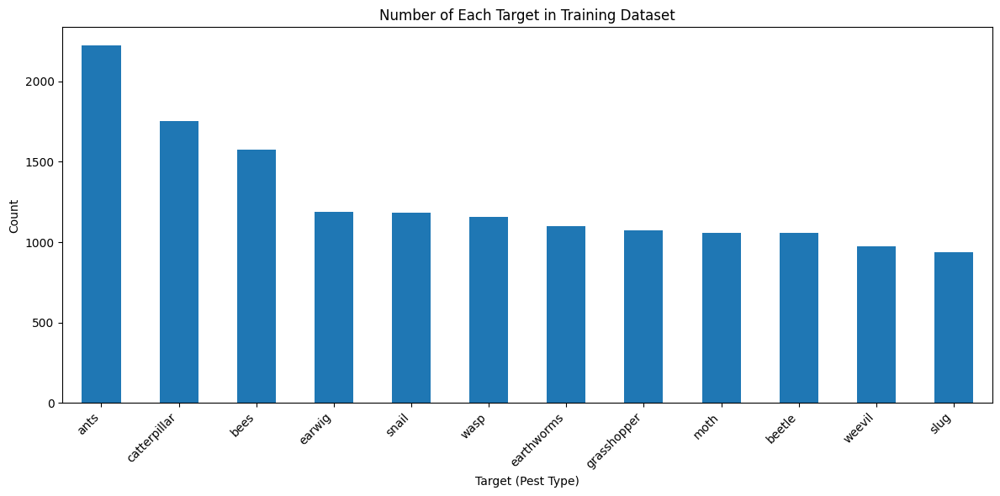

# Dataset: AgroPest-12

The image data is **not committed to this repository** (≈560 MB, ~17k images).
Download it once and point `data/data.yaml` at it.

**Source:** R. Majumdar, *AgroPest-12: A 12-Class Image Dataset of Crop Insects and Pests*, Kaggle, 2025. [`rupankarmajumdar/crop-pests-dataset`](https://www.kaggle.com/datasets/rupankarmajumdar/crop-pests-dataset)

## Download

```bash
# Requires Kaggle credentials in ~/.kaggle/kaggle.json
# or the KAGGLE_USERNAME / KAGGLE_KEY environment variables.
python -m agropest.data --out data/data.yaml
```

Or download the archive manually, extract it to `data/AgroPest-12/`, and run:

```bash
python -m agropest.data --dataset-root data/AgroPest-12 --out data/data.yaml
```

## Layout

The dataset already ships in YOLO format, so no conversion is needed:

```
AgroPest-12/
├── train/
│   ├── images/          # 15,281 images
│   └── labels/          # one .txt per image: <class> <cx> <cy> <w> <h>, normalised
├── valid/
│   ├── images/          #  1,341 images
│   └── labels/
└── test/
    ├── images/          #    546 images / 689 annotated instances
    └── labels/
```

## Classes

| Index | Class | Index | Class |
|---|---|---|---|
| 0 | Ants | 6 | Grasshoppers |
| 1 | Bees | 7 | Moths |
| 2 | Beetles | 8 | Slugs |
| 3 | Caterpillars | 9 | Snails |
| 4 | Earthworms | 10 | Wasps |
| 5 | Earwigs | 11 | Weevils |

Class order is fixed by the integer indices in the label files. Code in this
repository reads names from `data.yaml` via `agropest.data.load_class_names`
rather than hard-coding them, so names and label indices cannot drift apart.

## Class balance

The training split is mildly imbalanced. `Ants` is the largest class at ~2,200
instances against ~940 for the smallest (`Slugs`):



The skew is not severe enough to require resampling: a majority-class classifier
would score ~15%, far below any of the models evaluated here.
